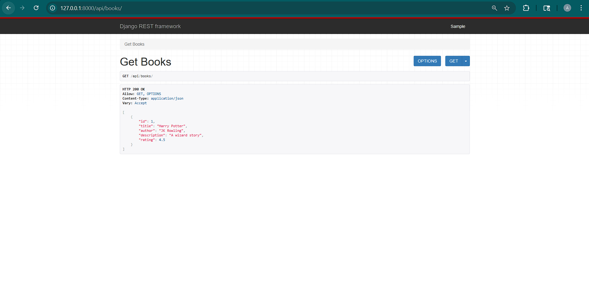
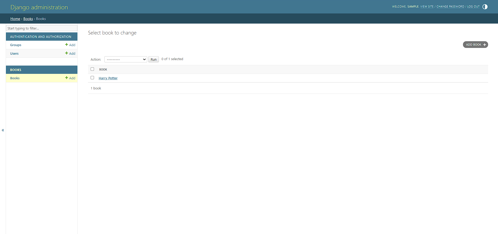
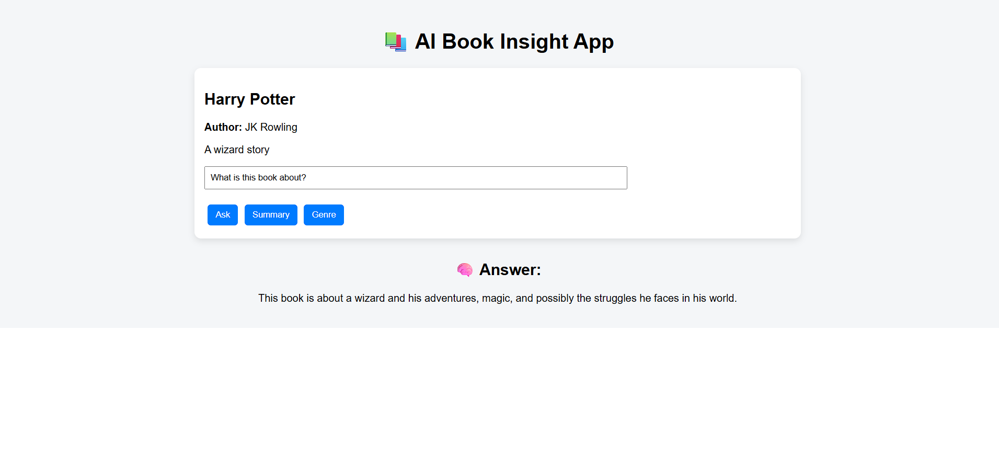

# 📚 AI Book Insight App

## 🚀 Features

* Book listing using Django backend
* AI-powered question answering
* Summary generation
* Genre prediction

## 🛠 Tech Stack

* Backend: Django REST Framework
* Frontend: ReactJS
* AI: OpenRouter (GPT-3.5)

## ⚙️ Setup Instructions

### Backend

cd backend
python manage.py runserver

### Frontend

cd backend/frontend
npm start

## 🔗 API Endpoints

* GET `/api/books/`
* GET `/api/book/<id>/`
* POST `/api/ask/`

## 🧠 Sample Request

{
"book_id": 1,
"question": "What is this book about?"
}

## 📸 Screenshots

### Admin Panel

### API Output

### Frontend UI

## 💡 Notes

* Used OpenRouter for AI integration
* Implemented basic RAG using book descriptions
